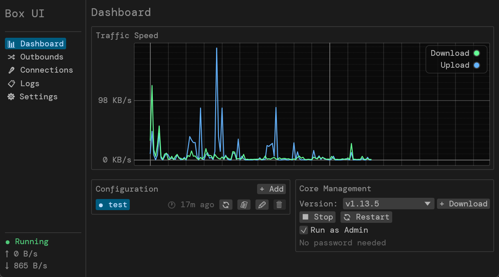

<p align="center">
  
</p>

<h1 align="center">Box UI</h1>

<p align="center">
  A lightweight, cross-platform GUI wrapper for <a href="https://github.com/SagerNet/sing-box">sing-box</a>, built with Rust and <a href="https://github.com/emilk/egui">egui</a>.
</p>

> **This is a pure vibe coding project** — built entirely through natural language conversation with AI (Claude Code). If you're curious about how the project is structured and guided, check out [CLAUDE.md](CLAUDE.md).

## What It Does

Box UI provides a minimal graphical interface for managing sing-box, replacing the need for command-line operation:

- **Configuration Management** — Import local configs, add remote subscription URLs, switch between multiple configurations
- **Core Management** — Download sing-box binaries from GitHub Releases, start/stop/restart with optional elevated privileges
- **Real-time Monitoring** — Traffic speed chart, outbound node selection, active connection table, streaming logs — all via the Clash API
- **System Integration** — System tray, autostart, privileged helper daemon for password-free elevated launches

Supports **Linux**, **macOS**, and **Windows**.

## Screenshot



## Philosophy

Box UI takes a fundamentally different approach from projects like [GUI.for.SingBox](https://github.com/nicehash/GUI.for.SingBox):

**The GUI never modifies or overrides the user's configuration.**

- **No config manipulation** — No toggling Tun mode, no injecting DNS settings, no merging rule sets. What you import is exactly what gets passed to sing-box.
- **No rule/node separation** — A configuration is a single, complete sing-box config file. You are fully responsible for its content.
- **Pure passthrough** — Box UI stores, switches, and delivers configs to the core, but never generates or transforms them.

This makes Box UI simpler and more predictable — you always know exactly what config the core is running, with no hidden overrides or magic merging.

## Build

```bash
cargo run              # Debug build
cargo build --release  # Release build
```

## License

[MIT](LICENSE)
